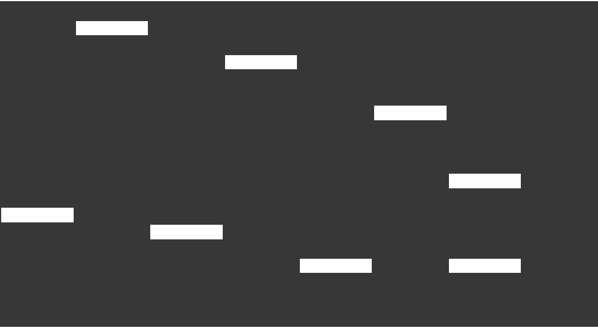
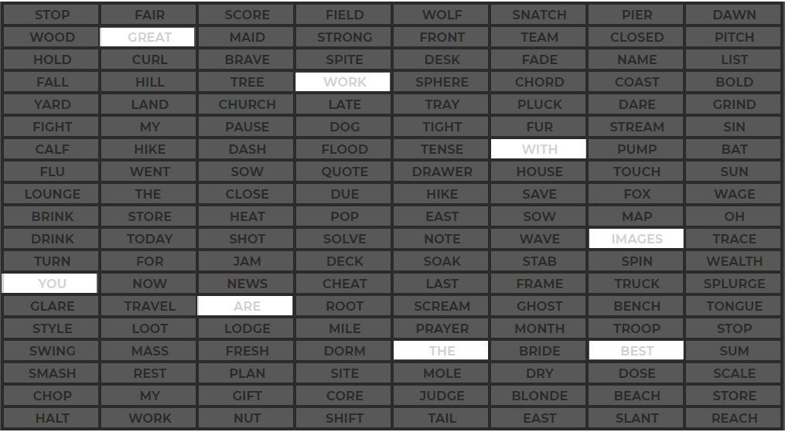

<center>
    
    <br/>
    <em>Python course materials</em>
</center>

# Image Exercise - Solution

In the folder "Working with Images" (same folder this notebook is located in) there are two images we will be working with:
* word_matrix.png
* mask.png

The word_matrix is a .png image that contains a spreadsheet of words with a hidden message in it. 

Your task is to use the mask.png image to reveal the hidden message inside the word_matrix.png. Keep in mind, you may need to resize the mask.png in order for this to work.

This exercise is more open-ended, so we won't guide you with the steps, instead, letting you explore and figure things out on your own as you would in a real world situation. However, if you get stuck, you can always view the solutions video or notebook for guidance. Best of luck!

#### Import Images


```python
from PIL import Image
```


```python
words = Image.open('word_matrix.png')
```


```python
words
```


    

    


```python
mask = Image.open("mask.png")
```


```python
mask
```


    

    


### Resize Images to Match


```python
mask.size
```


    (505, 251)


```python
words.size
```


    (1015, 559)


```python
mask = mask.resize((1015,559))
```


```python
mask.size
```


    (1015, 559)


### Add in alpha parameter

Now we can't just paste them over, otherwise we won't see what is underneath, we need to add an alpha value.


```python
mask.putalpha(200)
# links.putalpha(128)
```


```python
mask
```


    

    


```python
words.paste(mask,(0,0),mask)
```


```python
words
```


    

    


Excellent! Hope you enjoyed this one!
