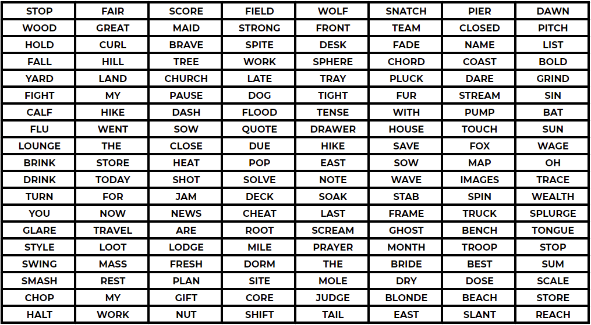
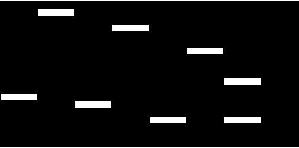

<center>
    
    <br/>
    <em>Python les-materialen</em>
</center>

# Image Exercise

In the folder "Working with Images" (same folder this notebook is located in) there are two images we will be working with:
* word_matrix.png
* mask.png

The word_matrix is a .png image that contains a spreadsheet of words with a hidden message in it.  

Your task is to use the mask.png image to reveal the hidden message inside the word_matrix.png. Keep in mind, you may need to make changes to the mask.png in order for this to work. That is all we'll say for now, since we really want you to discover this on your own!

This exercise is more open-ended, so we won't guide you with the steps, instead, letting you explore and figure things out on your own as you would in a real world situation. However, if you get stuck, you can always view the solutions video or notebook for guidance. Best of luck!


```python

```


    

    


```python

```


    

    


