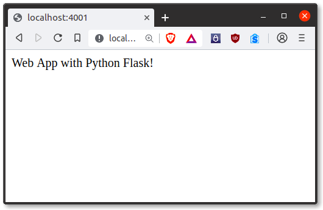

<center>
    
    <br/>
    <em>Python les-materialen</em>
</center>

# Flask

Flask is een webframework, het is een Python-module waarmee je eenvoudig webapplicaties kunt ontwikkelen. Het heeft een kleine en gemakkelijk uit te breiden kern: het is een microframework dat geen ORM (Object Relational Manager) of dergelijke functies bevat.

Het heeft veel coole functies zoals url-routering, sjabloonengine. Het is een WSGI-web app framework.

## Wat is een Web Framework?

Een Web Application Framework of een gewoon een Web Framework vertegenwoordigt een verzameling bibliotheken en modules waarmee ontwikkelaars van webtoepassingen toepassingen kunnen schrijven zonder zich zorgen te hoeven maken over details op laag niveau, zoals protocol, thread-beheer, enzovoort.

## Wat is Flask?

Flask is een webapplicatie framework geschreven in Python. Het werd ontwikkeld door Armin Ronacher, die een team van internationale Python-enthousiastelingen leidde genaamd Poocco. Flask is gebaseerd op de Werkzeg WSGI toolkit en de Jinja2 template engine. Beide zijn Pocco-projecten.

### WSGI

De Webserver Gateway Interface (Webserver Gateway Interface, WSGI) is gebruikt als standaard voor de ontwikkeling van Python-webtoepassingen. WSGI is de specificatie van een gemeenschappelijke interface tussen webservers en webapplicaties.

### Werkzeug

Werkzeug is een WSGI-toolkit die aanvragen, response-objecten en hulp-programmafuncties implementeert. Hierdoor kan er een web-frame op gebouwd worden. Het Flask framework gebruikt Werkzeug als een van zijn bases.

### jinja2

jinja2 is een populaire sjabloonengine voor Python. Een web-sjablonensysteem combineert een sjabloon met een specifieke gegevensbron om een dynamische webpagina weer te geven.

Hiermee kunt u Python-variabelen als volgt doorgeven aan HTML-sjablonen:


<html>
    <head>
        <title>{{ title }}</title>
    </head>
    <body>
        <h1>Hello {{ username }}</h1>
    </body>
</html>


### [](https://pythonbasics.org/what-is-flask-python/#Microframework "Microframework")Microframewerk

Kolf wordt vaak een microframework genoemd. Het is ontworpen om de kern van de applicatie eenvoudig en schaalbaar te houden.

In plaats van een abstractielaag voor database-ondersteuning, ondersteunt Flask extensies om dergelijke mogelijkheden aan de toepassing toe te voegen.

## [](https://pythonbasics.org/what-is-flask-python/#Why-is-Flask-a-good-web-framework-choice "Why is Flask a good web framework choice?")Waarom is Flask een goede keuze voor een webframework?

In tegenstelling tot het Django-framework is Flask erg Pythonisch. Het is gemakkelijk om aan de slag te gaan met Flask, omdat het geen enorme leercurve heeft.

Bovendien is het erg expliciteit, wat de leesbaarheid verhoogt. Om de "Hello World" -app te maken, hebt u slechts een paar regels code nodig.

Dit is een voorbeeld van een boilerplate-code.


```python
from flask import Flask
app = Flask(__name__)

@app.route('/')
def hello_world():
    return 'Hello World!'

if __name__ == '__main__':
    app.run()
```

     * Serving Flask app '__main__' (lazy loading)
     * Environment: production
       WARNING: This is a development server. Do not use it in a production deployment.
       Use a production WSGI server instead.
     * Debug mode: off
    

     * Running on http://127.0.0.1:5000 (Press CTRL+C to quit)
    127.0.0.1 - - [13/Apr/2022 14:18:13] "GET / HTTP/1.1" 200 -
    127.0.0.1 - - [13/Apr/2022 14:18:13] "GET /favicon.ico HTTP/1.1" 404 -
    

Als u op uw lokale computer wilt ontwikkelen, kunt u dit eenvoudig doen. Sla dit programma op als en voer het uit met .`server.py``python server.py`

```bash
$ python server.py
 * Serving Flask app "hello"
 * Running on http://127.0.0.1:5000/ (Press CTRL+C to quit)
```

Het start dan een webserver die alleen beschikbaar is op uw computer. Open in een webbrowser localhost op poort 5000 (de url) en je ziet "Hello World" verschijnen.
Om online te hosten en te ontwikkelen, kunt u [PythonAnywhere](https://www.pythonanywher.com/?affiliate_id=00535ced) gebruiken

Enkele voorbeelden van uitvoer:



Het is een microframework, maar dat betekent niet dat je hele app zich in één Python-bestand moet bevinden. U kunt en moet veel bestanden gebruiken voor grotere programma's, om complexiteit te verwerken.

Micro betekent dat het Flask-framework eenvoudig maar uitbreidbaar is. U kunt alle beslissingen nemen: welke database te gebruiken, wilt u een ORM enz. Flask beslist niet voor u.

Flask is een van de meest populaire web-frameworks, wat betekent dat het up-to-date en modern is. U kunt de functionaliteit eenvoudig uitbreiden. U kunt het opschalen voor complexe toepassingen.


