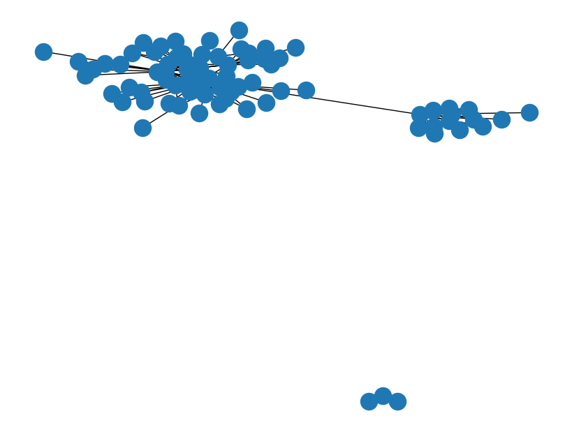

## Network Visualization in Python

- Helper notebook for article of same name published on Medium.

### Import


```python
import pandas as pd
import networkx as nx
import matplotlib.pyplot as plt
%matplotlib inline
```


    ---------------------------------------------------------------------------

    ModuleNotFoundError                       Traceback (most recent call last)

    c:\Users\Administrator\Desktop\python-notebooks\Notebooks\Nederlands\Milestone Project 4 - Game of Thrones - Netwerkvisualisatie\GoT_Network.ipynb Cell 3' in <cell line: 2>()
          <a href='vscode-notebook-cell:/c%3A/Users/Administrator/Desktop/python-notebooks/Notebooks/Nederlands/Milestone%20Project%204%20-%20Game%20of%20Thrones%20-%20Netwerkvisualisatie/GoT_Network.ipynb#ch0000002?line=0'>1</a> import pandas as pd
    ----> <a href='vscode-notebook-cell:/c%3A/Users/Administrator/Desktop/python-notebooks/Notebooks/Nederlands/Milestone%20Project%204%20-%20Game%20of%20Thrones%20-%20Netwerkvisualisatie/GoT_Network.ipynb#ch0000002?line=1'>2</a> import networkx as nx
          <a href='vscode-notebook-cell:/c%3A/Users/Administrator/Desktop/python-notebooks/Notebooks/Nederlands/Milestone%20Project%204%20-%20Game%20of%20Thrones%20-%20Netwerkvisualisatie/GoT_Network.ipynb#ch0000002?line=2'>3</a> import matplotlib.pyplot as plt
          <a href='vscode-notebook-cell:/c%3A/Users/Administrator/Desktop/python-notebooks/Notebooks/Nederlands/Milestone%20Project%204%20-%20Game%20of%20Thrones%20-%20Netwerkvisualisatie/GoT_Network.ipynb#ch0000002?line=3'>4</a> get_ipython().run_line_magic('matplotlib', 'inline')
    

    ModuleNotFoundError: No module named 'networkx'


### Load and process data


```python
# load data
df = pd.read_csv("data/book1.csv")
# pick only important weights (hard threshold)
df = df.loc[df['weight']>10, :]
df
```


<div>
<style scoped>
    .dataframe tbody tr th:only-of-type {
        vertical-align: middle;
    }

    .dataframe tbody tr th {
        vertical-align: top;
    }

    .dataframe thead th {
        text-align: right;
    }
</style>
<table border="1" class="dataframe">
  <thead>
    <tr style="text-align: right;">
      <th></th>
      <th>Source</th>
      <th>Target</th>
      <th>Type</th>
      <th>weight</th>
      <th>book</th>
    </tr>
  </thead>
  <tbody>
    <tr>
      <th>8</th>
      <td>Aemon-Targaryen-(Maester-Aemon)</td>
      <td>Jeor-Mormont</td>
      <td>Undirected</td>
      <td>13</td>
      <td>1</td>
    </tr>
    <tr>
      <th>9</th>
      <td>Aemon-Targaryen-(Maester-Aemon)</td>
      <td>Jon-Snow</td>
      <td>Undirected</td>
      <td>34</td>
      <td>1</td>
    </tr>
    <tr>
      <th>16</th>
      <td>Aerys-II-Targaryen</td>
      <td>Robert-Baratheon</td>
      <td>Undirected</td>
      <td>12</td>
      <td>1</td>
    </tr>
    <tr>
      <th>17</th>
      <td>Aggo</td>
      <td>Daenerys-Targaryen</td>
      <td>Undirected</td>
      <td>11</td>
      <td>1</td>
    </tr>
    <tr>
      <th>30</th>
      <td>Alliser-Thorne</td>
      <td>Jon-Snow</td>
      <td>Undirected</td>
      <td>32</td>
      <td>1</td>
    </tr>
    <tr>
      <th>...</th>
      <td>...</td>
      <td>...</td>
      <td>...</td>
      <td>...</td>
      <td>...</td>
    </tr>
    <tr>
      <th>658</th>
      <td>Sandor-Clegane</td>
      <td>Sansa-Stark</td>
      <td>Undirected</td>
      <td>23</td>
      <td>1</td>
    </tr>
    <tr>
      <th>664</th>
      <td>Shae</td>
      <td>Tyrion-Lannister</td>
      <td>Undirected</td>
      <td>12</td>
      <td>1</td>
    </tr>
    <tr>
      <th>666</th>
      <td>Shagga</td>
      <td>Tyrion-Lannister</td>
      <td>Undirected</td>
      <td>17</td>
      <td>1</td>
    </tr>
    <tr>
      <th>676</th>
      <td>Tyrion-Lannister</td>
      <td>Tywin-Lannister</td>
      <td>Undirected</td>
      <td>40</td>
      <td>1</td>
    </tr>
    <tr>
      <th>683</th>
      <td>Waymar-Royce</td>
      <td>Will-(prologue)</td>
      <td>Undirected</td>
      <td>18</td>
      <td>1</td>
    </tr>
  </tbody>
</table>
<p>175 rows × 5 columns</p>
</div>


```python
# import
import networkx as nx
# load pandas df as networkx graph
G = nx.from_pandas_edgelist(df, 
                            source='Source', 
                            target='Target', 
                            edge_attr='weight')
print("No of unique characters:", len(G.nodes))
print("No of connections:", len(G.edges))

```

    No of unique characters: 80
    No of connections: 175
    

## Option 1: NetworkX


```python
# all graph options
graphs_viz_options = [nx.draw, nx.draw_networkx, nx.draw_circular, nx.draw_kamada_kawai, nx.draw_random, nx.draw_shell, nx.draw_spring]

# plot graph option
selected_graph_option = 0

# plot
plt.figure(figsize=(8,6), dpi=100) 
graphs_viz_options[selected_graph_option](G)
```


    

    


## Option 2: PyVis


```python
# import pyvis
from pyvis.network import Network
# create vis network
net = Network(notebook=True, width=1000, height=600)
# load the networkx graph
net.from_nx(G)
# show
net.show("example.html")
```


<iframe
    width="1000"
    height="600"
    src="example.html"
    frameborder="0"
    allowfullscreen
></iframe>


## Option 3: Visdcc in Dash

- See `dash_app.py` file for the demo.

### Extra - get all draw functions in NetworkX


```python
from inspect import getmembers
for x in getmembers(nx):
    if 'draw' in x[0]:
        print(x)
```

    ('draw', <function draw at 0x0000023163903BF8>)
    ('draw_circular', <function draw_circular at 0x0000023163903F28>)
    ('draw_kamada_kawai', <function draw_kamada_kawai at 0x0000023163909048>)
    ('draw_networkx', <function draw_networkx at 0x0000023163903C80>)
    ('draw_networkx_edge_labels', <function draw_networkx_edge_labels at 0x0000023163903EA0>)
    ('draw_networkx_edges', <function draw_networkx_edges at 0x0000023163903D90>)
    ('draw_networkx_labels', <function draw_networkx_labels at 0x0000023163903E18>)
    ('draw_networkx_nodes', <function draw_networkx_nodes at 0x0000023163903D08>)
    ('draw_planar', <function draw_planar at 0x00000231639092F0>)
    ('draw_random', <function draw_random at 0x00000231639090D0>)
    ('draw_shell', <function draw_shell at 0x0000023163909268>)
    ('draw_spectral', <function draw_spectral at 0x0000023163909158>)
    ('draw_spring', <function draw_spring at 0x00000231639091E0>)
    ('drawing', <module 'networkx.drawing' from 'C:\\Users\\Mohit\\Anaconda3\\lib\\site-packages\\networkx\\drawing\\__init__.py'>)
    ('planar_drawing', <module 'networkx.algorithms.planar_drawing' from 'C:\\Users\\Mohit\\Anaconda3\\lib\\site-packages\\networkx\\algorithms\\planar_drawing.py'>)
    
